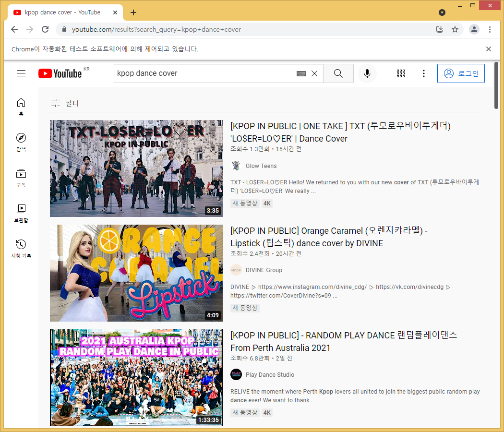

#### 기존 파이썬에 대해서(기초) 
- 파이썬에 대해서1: https://blog.daum.net/web_design/496
- 파이썬에 대해서2: https://blog.daum.net/web_design/768
- 위 글에 이어서 파이썬 활용에 대해서 인프런의 파이썬 레시피 라는 강좌를 기초로 정리하겠습니다.(아래)

### 20211013(수): 03_smtp/gmail.py
- 파이썬으로 메일 보내기: 첨부파일용 MIMEMultipart 모듈 사용
- 첨부파일을 헤더로 전송하기 위한  with 파일 처리 함수 사용
- 파이썬의 sendmail 함수사용

### 20211011(월): 02_selenium/color_bot.py
- 배너닫기 문제가 아니고, 개체가 화면에 모두 보여야 문제 없음.
- 그래서, 화면을 해당하는 개체로 상단 이동하게 처리(아래)
```json
# description element 까지 스크롤(아래 1줄 사용)
# driver.execute_script('window.scrollTo(0, document.querySelector("#grid").offsetHeight)')
# 자바스크립트를 여러줄 사용시(아래)
temp = '''
    var location = document.querySelector("#grid").offsetHeight;
    window.scrollTo(0, location);
'''
driver.execute_script(temp)
```

#### 20211010(일): 02_selenium/color.py
- 색감 테스트: 주어진 시간안에 다른 색을 선택하기
- 단, 실행후 배너창을 닫아야 합니다.(배너닫기 봇을 추가해 봅니다.)

#### 20211008(금): 02_selenium/1to50.py
- 1 to 50 웹게임을 자동화 해서 실행하는 파이썬 프로그램
- 함수생성과 함수 내에서 전역변수 사용하기

#### 20211007(목): 02_selenium/auto_youtube.py
- 파이썬 자동화: selenium 으로 외부프로그램 실행(크롬 웹 자동화)
- 파이참 > File > Settings > Python Interpreter > selenium 모듈 설치
- 크롬 드라이버 설치: 웹 브라우저 제어용 프로그램. 현재 버전 94 다운로드
- https://chromedriver.chromium.org/downloads (현재 기준 버전 94.x.x)
- 작업결과(아래확인: 크롬브라우저 상단에 'Chrome 이 자동화된 테스트 소프트웨어에 의해 제어되고 있습니다.')
  

#### 20211006(수): 01_bs4/naver_webtoon_thumbnail.py
- urllib.request 스텁에서 가져온 함수 urlretrieve 를 사용해서 이미지파일 다운로드.
- 스텁 (*.pyi) 파일 이란 참조: https://www.python.org/dev/peps/pep-0484/#stub-files

#### 20211004(월): 01_bs4/naver_webtoon_title.py
- 작업1: [월요 웹툰영역 find] - [해당영역제목 findAll] - [for 문 text 추출]
- 작업2: [요일별 웹툰영역 findAll] - [해당영역제목 findAll] - [for 문 text 추출]

#### 20211003(일): 01_bs4/naver_dust.py
- 뷰티풀 소프 라는 soup 프로토콜 파싱툴을 이용해서 네이버 미세먼지 크롤링
- 참고: 스프링(부트)에서는 보통 Json 파싱툴을 사용합니다.